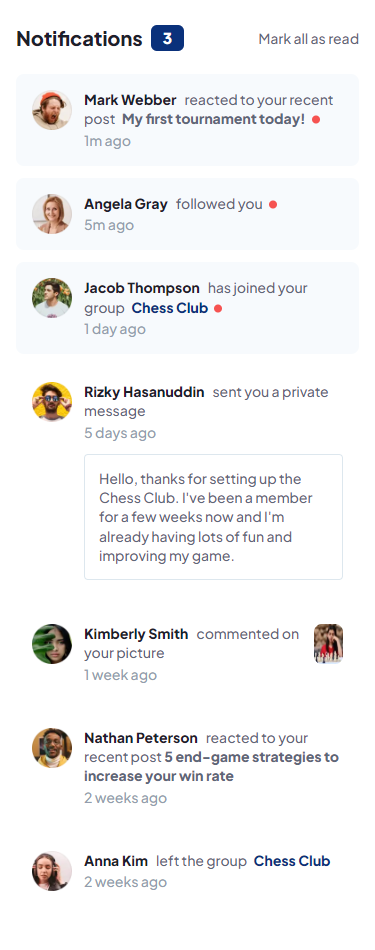
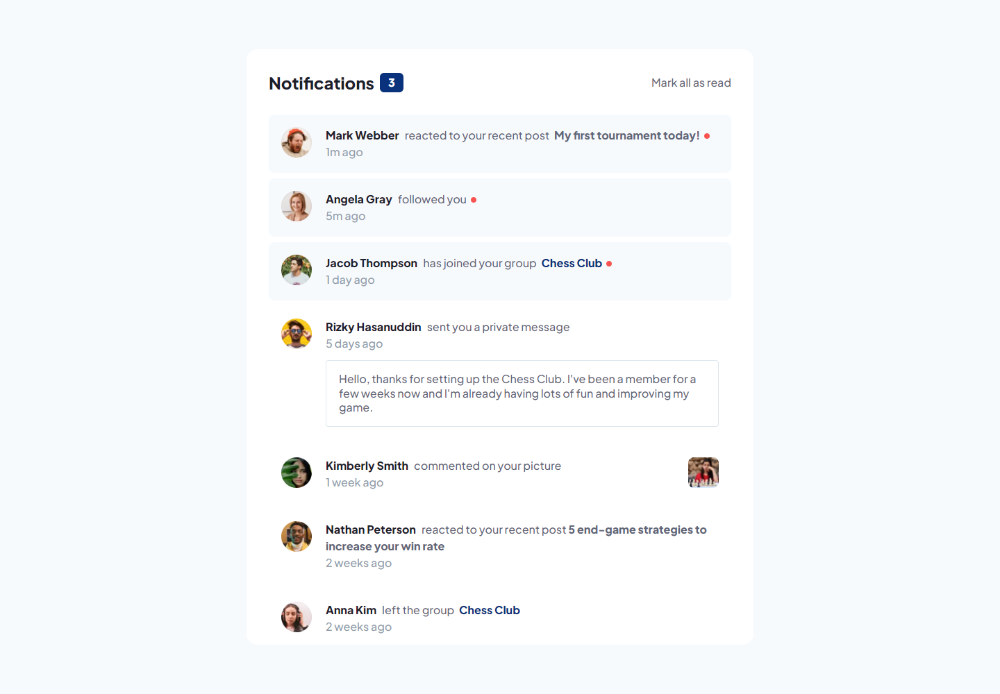
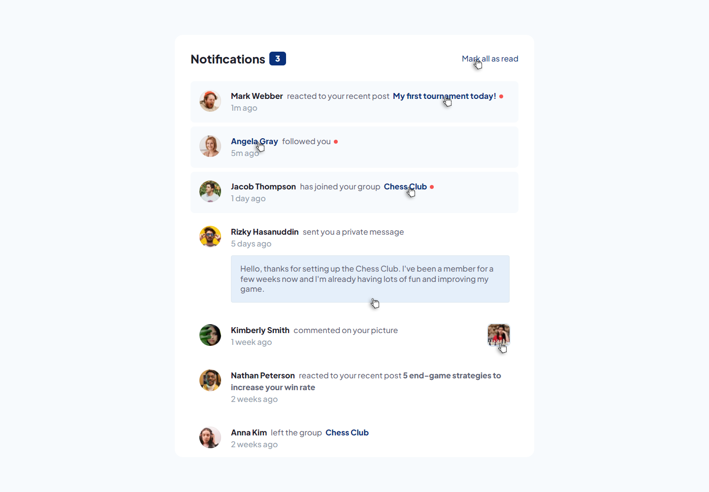

# Frontend Mentor - Notifications page solution

This is a solution to the [Notifications page challenge on Frontend Mentor](https://www.frontendmentor.io/challenges/notifications-page-DqK5QAmKbC).

## Table of contents

- [Overview](#overview)
  - [The challenge](#the-challenge)
  - [Screenshot](#screenshot)
  - [Links](#links)
- [My process](#my-process)
  - [Built with](#built-with)
- [Author](#author)

## Overview

### The challenge

Users should be able to:

- Distinguish between "unread" and "read" notifications
- Click individually on unread notification and set it to read
- Select "Mark all as read" to toggle the visual state of the unread notifications and set the number of unread messages to zero (disappear)
- View the optimal layout for the interface depending on their device's screen size
- See hover and focus states for all interactive elements on the page

### Screenshot

### Links

- Live Site URL: [Preview](https://nkshey.github.io/notifications-page/)
- Solution URL: [https://github.com/nkshey/notifications-page](https://github.com/nkshey/notifications-page)

## My process

### Built with

- Semantic HTML5 markup
- CSS custom properties
- Flexbox
- CSS Grid
- Mobile-first workflow
- [React](https://reactjs.org/) - JS library
- [Vite](https://vitejs.dev/) - Build tool
- [Zustand](https://zustand-demo.pmnd.rs/) - For state management
- [Tailwind CSS](https://tailwindcss.com/) - For styles

## Author

- LinkedIn - [Nikoloz Peikrishvili](https://www.linkedin.com/in/nikapeikrishvili/)
- Frontend Mentor - [@nkshey](https://www.frontendmentor.io/profile/nkshey)
